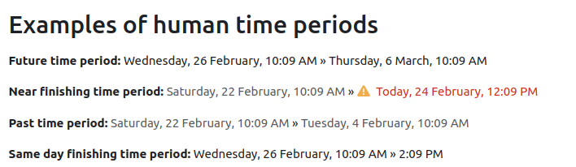

<Since version="5.0" issueNumber="MDL-83873" />

The `humandate` and `humantimeperiod` classes in Moodle are designed to render timestamps and time periods in a human-readable format. These classes provide functionality to display dates as "Today", "Yesterday", "Tomorrow", and apply alert styling if the date is near the current date.

## Using human time representation output classes

Both classes can be used as a normal output class in Moodle. Each class represent way of show dates and time in a human readable way:

- `humandate`: This renderer presents single dates and times in a user-friendly format, automatically adapting to the user's preferences and with some extra customization options.
- `humantimeperiod`: Designed for displaying date/time ranges, this renderer optimizes information presentation, eliminating redundant date information and representing time in a more user friendly way.

### `humandate` Class

The `humandate` class is used to render a single timestamp as a human-readable date.



#### Constructor parameters

The `humandate` class constructor accepts the following parameters:

- **`timestamp`** (int): The Unix timestamp to be rendered.
- **`near`** (int|null): The number of seconds that indicates a nearby date. Defaults to `DAYSECS`, use `null` for no indication. Near dates will be rendered with a different styling depending on the theme (usually red with a warning icon).
- **`timeonly`** (bool): Whether to show only the time or the full date and time. Defaults to `false`.
- **`link`** (url|null): an optional URL to link the date to.
- **`langtimeformat`** (string|null): an optional lang date and time format to use to format the date. Otherwise the output will use the user's preferences or the system default.
- **`userelatives`** (bool): Whether to use human common words (tomorrow, yesterday) when possible. Defaults to `true`.

### Example Usage

This will output "Today" if the timestamp is for the current day.

```php
use core_calendar\output\humandate;

$renderer = $PAGE->get_renderer('core', 'output');
$timestamp = time() + HOURSECS;

// Basic example.
$humandate = new humandate($timestamp);
echo $renderer->render($humandate);

// Example adding a link to the date.
$humandate = new humandate(
    timestamp: $timestamp,
    link: new core\url('/calendar/view.php', ['view' => 'day', 'time' => $timestamp]),
);
echo $renderer->render($humandate);

// Example showing only the time.
$humandate = new humandate(
    timestamp: $timestamp,
    timeonly: true,
);
echo $renderer->render($humandate);
```

### `humantimeperiod` Class

The `humantimeperiod` class is used to render a time period in a human-readable format.


#### Constructor parameters

The `humantimeperiod` class constructor accepts the following parameters:

- **`starttimestamp`** (int): The starting timestamp.
- **`endtimestamp`** (int): The ending timestamp.
- **`near`** (int|null): The number of seconds that indicates a nearby date. Defaults to `DAYSECS`, use `null` for no indication.
- **`link`** (url|null): URL to link the date to.
- **`langtimeformat`** (string|null): Lang date and time format to use to format the date.
- **`userelatives`** (bool): Whether to use human common words or not.

### Example Usage

```php
use core_calendar\output\humantimeperiod;

$renderer = $PAGE->get_renderer('core', 'output');
$starttimestamp = time();
$endtimestamp = time() + HOURSECS;

// Basic example.
$humantimeperiod = new humantimeperiod($starttimestamp, $endtimestamp);
echo $renderer->render($humantimeperiod);

// Example adding a link to the date.
$humantimeperiod = new humantimeperiod(
    starttimestamp: $starttimestamp,
    endtimestamp: $endtimestamp,
    link: new core\url('/calendar/view.php', ['view' => 'day', 'time' => $starttimestamp]),
);
echo $renderer->render($humantimeperiod);
```
